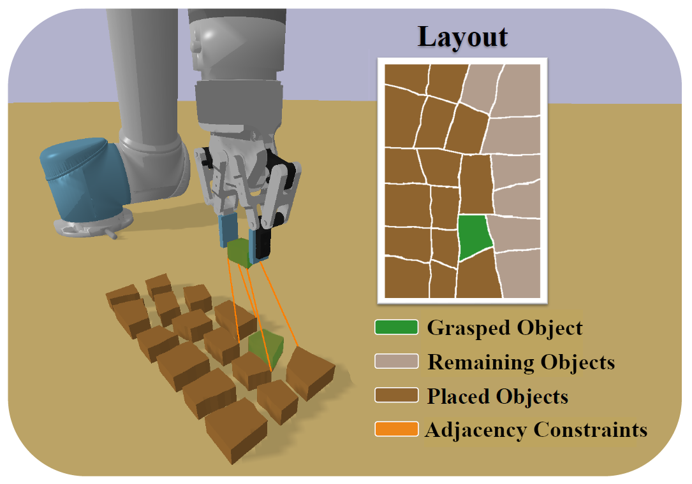

# Compact RL Placement

<a href="https://ieeexplore.ieee.org/abstract/document/10769899"></a>

This repository contains the accompanying code for the paper "Compact Multi-Object PlacementUsing Adjacency-Aware Reinforcement Learning" by B. Kreis, N. Dengler, J. de Heuvel, R. Menon, H. D. Perur, M. Bennewitz accepted to the IEEE-RAS International Conference on Humanoid Robots (Humanoids). You can find the paper on [arXiv](https://arxiv.org/abs/2404.10632) and [IEEE Xplore](https://ieeexplore.ieee.org/abstract/document/10769899).

## Getting started
Setup a Python 3.10 virtual environment e.g. "fragment-gym". We use [Virtualenv](https://virtualenv.pypa.io/en/latest/) with [Virtualenvwrapper](https://virtualenvwrapper.readthedocs.io/en/latest/). Alternatively, you can use [Conda](https://docs.conda.io/en/latest/).

To create the virtual environment with Virtualenvwrapper you have to run:
```
mkvirtualenv --python="/usr/bin/python3.10" fragment-gym
```

Ensure that you are using the correct versions for setuptools and wheel:
```
pip3 install setuptools==57.5.0 wheel==0.37.1
```

Install the requirements using pip3:
```
pip3 install -r fragment_gym_requirements.txt
```

Go to the root folder of this project and install the fragment_gym package with:
```
cd fragment_gym
pip3 install -e .
```

To use the evaluation bash script you have to install the task-spooler.
```
sudo apt install task-spooler
```

## Usage
If you are using Virtualenv with Virtualenvwrapper, make sure that you are in the correct environment.
```
workon fragment-gym
```

To see the available parameters check out the top of the corresponding Python file or print them using the -h argument:
```
python3 train_rl -h
python3 run_baseline.py -h
```

### Train an RL agent
To train an RL agent, you have to create a new config file and specify it when you start the training with:
```
python3 train_rl.py -m=train -c=config_file_name
```
To train an ablated version you have to set the `-abl` flag to `"no_ruler"`.

### Test an RL agent
The model name and the tensorboard log name are derived from the config file name. By default the GUI is not shown which allows to train in headless mode. If you want to see the GUI, you have to set the -g argument as shown below. Running the test mode executes single fragment placements. To place a complete fresco, please refer to the evaluation commands below.

```
python3 train_rl.py -m=test -c=config_file_name -g=y
```
To test or evaluate an ablated version you have to set the `-abl` flag to `"no_ruler"`.

### Evaluation
To run multiple evaluations in parallel with the task-spooler, you can use the following bash script. It works for evaluations of trained agents as well as baselines.

First you have to make it executable with:
```
chmod +x ./eval.sh
```

Then you can use it like (chunk_size,job_size are optional arguments):
```
./eval.sh <start_fresco_id,stop_fresco_id,chunk_size,job_size> run_baseline.py <python args>
```

E.g., the following command will evaluate fresco_0, fresco_1 with a chunk size of 2:
```
./eval.sh 0,1,2 run_baseline.py -c=baseline_scaling_fresco
```

To check the running tasks, you can use:
```
tsp
```

Please note that the provided agent and fragment models are examples and cannot reproduce the results of the paper.

### Run the baseline
```
python3 run_baseline.py -c=config_file_name -g=y
```

### Weights and Biases Support
Tensorboard logs are uploaded to Weights and Biases. If you use it for the first time, you have to login in and enter your credentials:
```
wandb login
```

Furthermore, you have to specify your wandb_project_name in the config file.

### Hugging Face Hub Support
Models are stored locally and in Hugging Face Hub. If the model is not available locally, it will pull it from Hugging Face Hub. If you use Hugging Face for the first time, you have to generate a token for your machine [here](https://huggingface.co/settings/tokens)

Afterwards, you have to login once using the command line and enter your token. When prompted to change your git credentials, press "n":
```
huggingface-cli login
```

Furthermore, you have to specify your huggingface_project_name in the config file.

## Known issues
When setting up the python environment using the requirements file, the version of setuptools==57.5.0 and wheel==0.37.1 have to be verified. For more information see [setuptools issue](https://github.com/giampaolo/psutil/issues/1268) and [wheel issue](https://github.com/openai/gym/issues/3202#issuecomment-1513593788)

## Citation
Please cite our research as:
```
@inproceedings{kreis24humanoids,
  title={Compact Multi-Object Placement Using Adjacency-Aware Reinforcement Learning}, 
  author={B. Kreis and N. Dengler and J. de Heuvel and R. Menon and H. Perur and M. Bennewitz},
  booktitle={Proc. of the IEEE-RAS Int. Conf. on Humanoid Robots (Humanoids)},
  doi={10.1109/Humanoids58906.2024.10769899},
  year={2024}
}
```